# 🛒 Pantry Pal Pro
**The Intelligent Kitchen Assistant**

Pantry Pal Pro is a state-of-the-art mobile application designed to eliminate food waste and simplify grocery management. Built with a premium design system, it combines cloud synchronization, AI-powered recipes, and intelligent scanning to keep your kitchen running like a well-oiled machine.

---

## ✨ Key Features

### 🔐 Secure Authentication
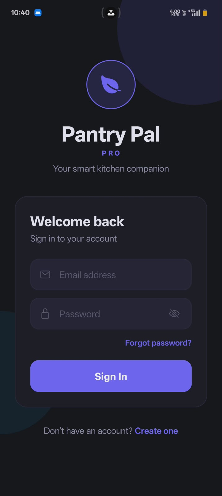 | 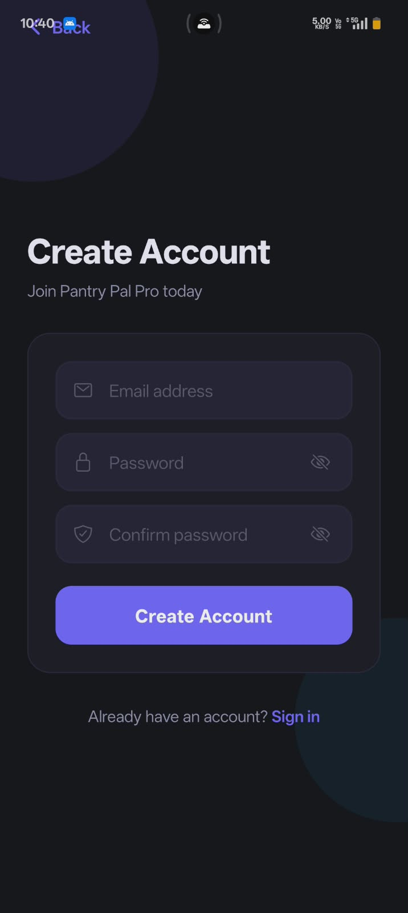
--- | ---
*Protect your data with encrypted accounts. Pantry Pal Pro uses Firebase Authentication to ensure your inventory is synced safely across all your devices.*

### 🚀 Custom Branding
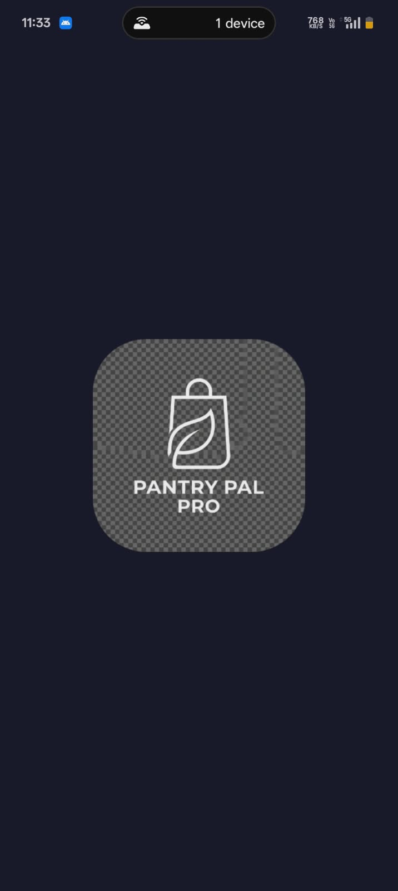
*A professional, seamless splash screen featuring our custom-designed identity.*

### 📊 Smart Inventory Dashboard
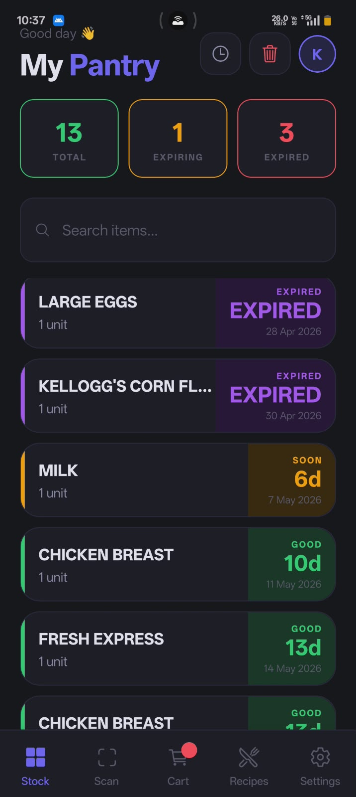
*A high-contrast, real-time dashboard providing instant visibility into your stock. Features color-coded urgency indicators for items that are Expiring Soon or Expired.*

### 🔍 AI Receipt Scanner & Review
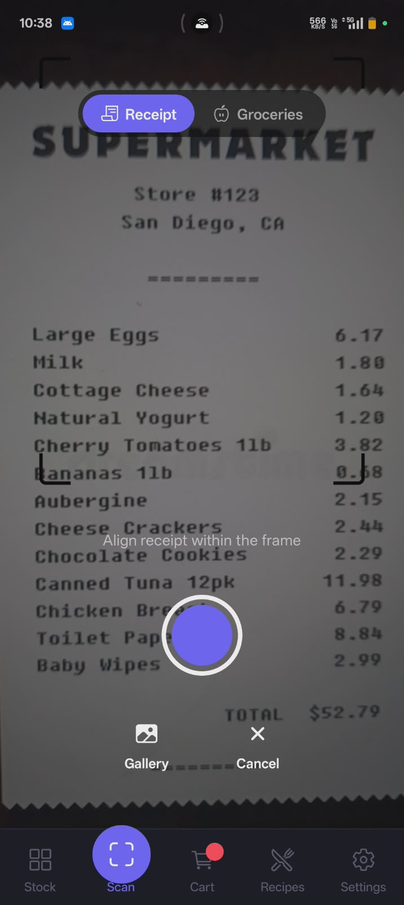 | 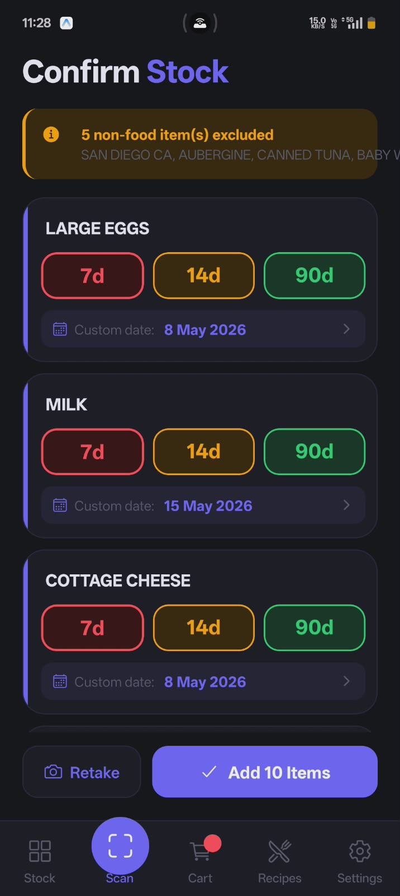
--- | ---
*Add groceries in seconds. After scanning, review your items and quickly assign shelf-life presets (7d, 14d, 90d).*

### 📅 Precision Expiry Tracking
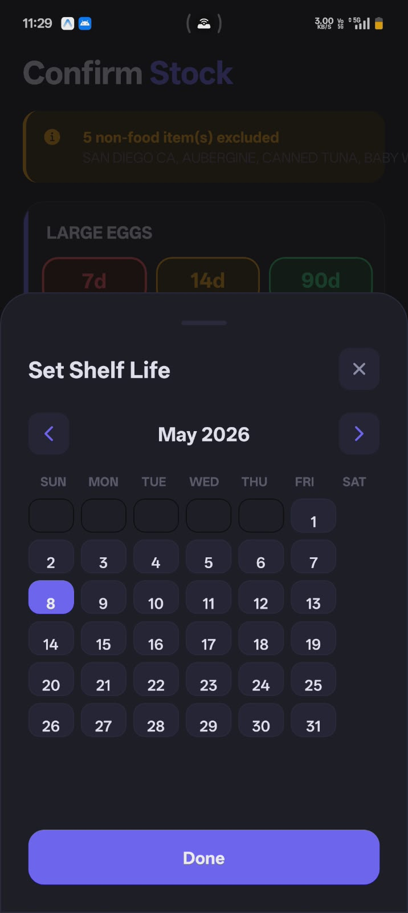 | 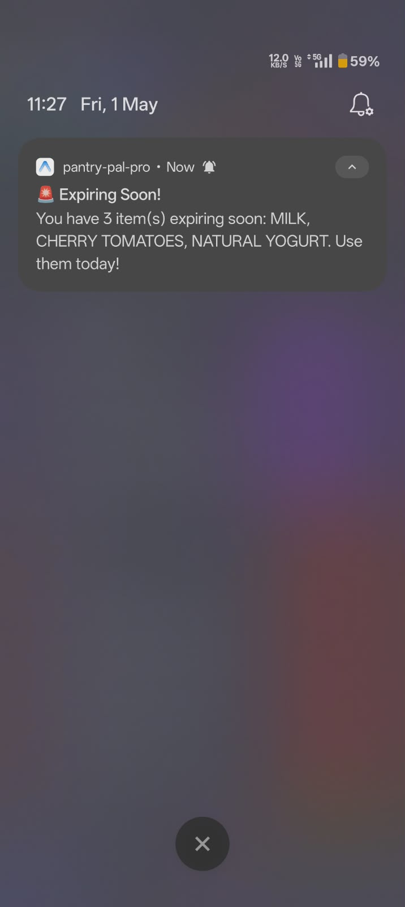
--- | ---
*Use the integrated calendar for custom dates and receive daily push notifications for items expiring soon.*

### ⚡ Effortless Control
 | 
--- | ---
*Manage your pantry with fluid gestures. Swipe right to restock (Add to Cart) or left to remove (Move to Bin).*

### 📜 Digital Archives
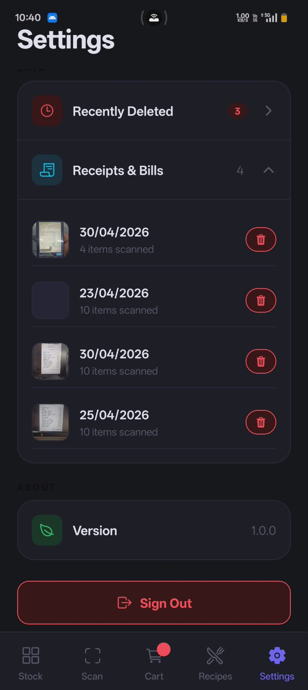
*Keep a searchable history of all your scanned bills and purchase dates.*

### 🍳 Intelligent Recipe Engine
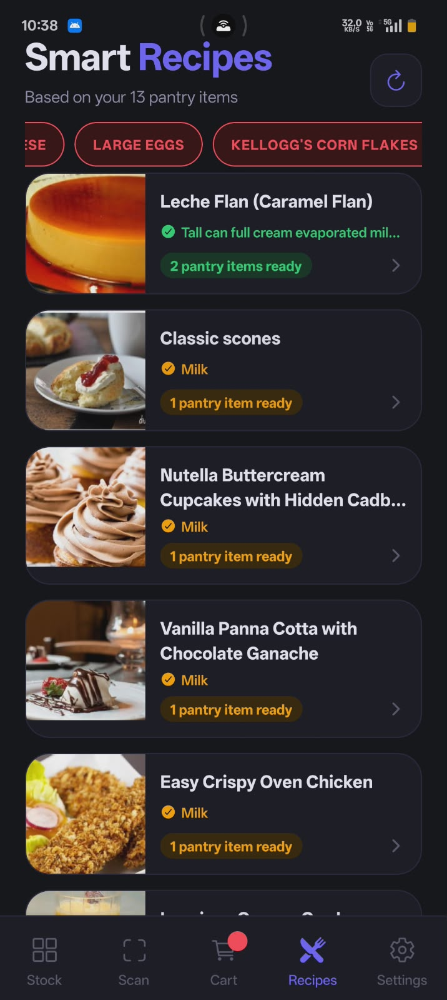 | 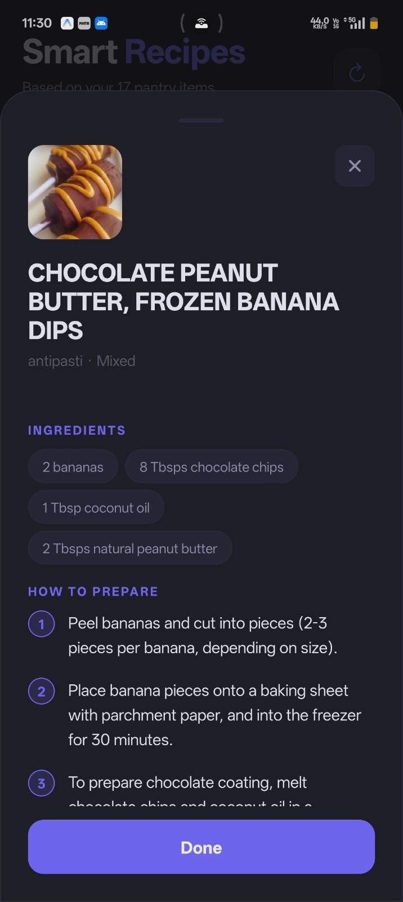
--- | ---
*Discover what's for dinner based on your stock, with full step-by-step instructions.*

### 🛒 Automated Shopping Cart
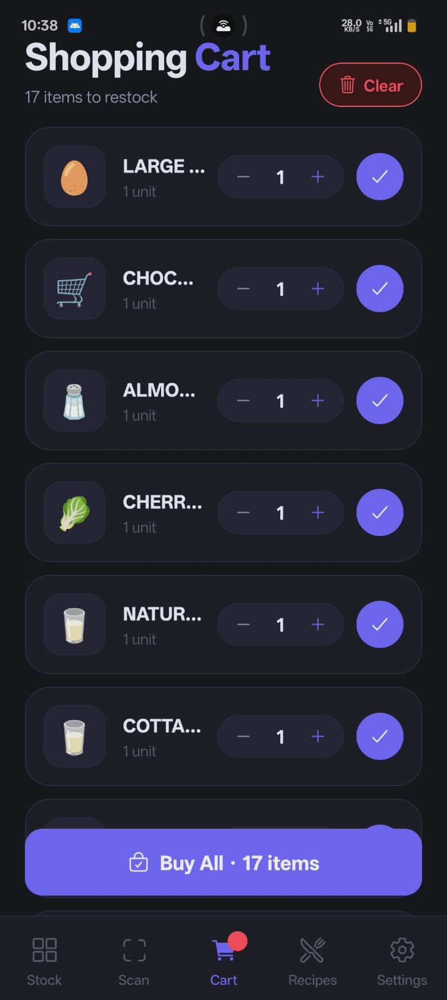
*Your grocery list, automatically populated with used or expired items.*

### 🎨 Dual-Theme Support
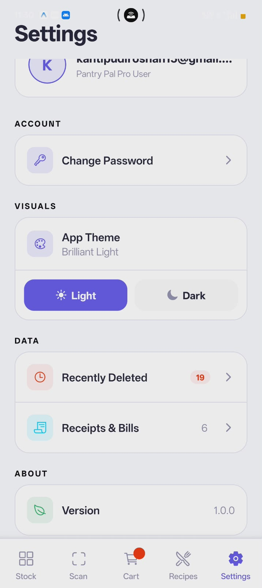 | 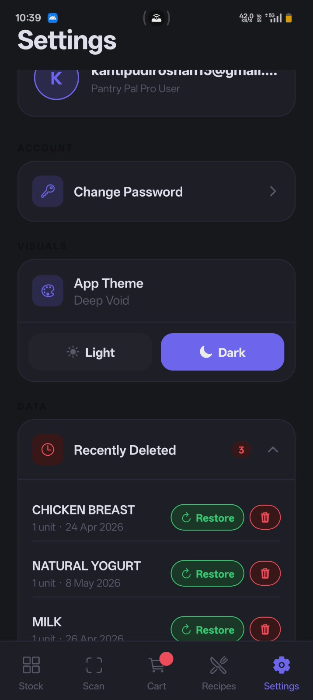
--- | ---
*Pantry Pal Pro adapts to your style. Switch between the Deep Void dark mode or the Brilliant Light theme with a single tap.*

---

## 🛠️ Tech Stack
- **Framework**: [Expo](https://expo.dev/) / [React Native](https://reactnative.dev/)
- **Database**: [Firebase Firestore](https://firebase.google.com/products/firestore)
- **Authentication**: Firebase Auth
- **Recipe Data**: [Spoonacular API](https://spoonacular.com/food-api)
- **Styling**: Custom Design System (Dual-Theme Support)

## 🚀 Getting Started

1. **Clone the repo**
   ```bash
   git clone https://github.com/Roshan08srm/pantry-pal-pro.git
   ```
2. **Install dependencies**
   ```bash
   npm install
   ```
3. **Set up Environment Variables**
   Create a `.env` file and add your keys:
   ```env
   EXPO_PUBLIC_SPOONACULAR_API_KEY=your_key_here
   ```
4. **Run the app**
   ```bash
   npx expo start
   ```
